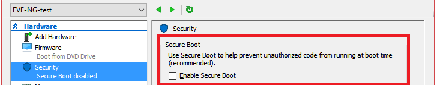

# How to Install EVE-NG on Microsoft Hyper-V

In this blog, I will guide you through the process of installing EVE-NG on Microsoft Hyper-V. Typically, I use GNS3 on VMware as recommended by the documentation. However, there is a glitch: Microsoft Hyper-V and WSL2 does not coexist well with VMWare on the same machine.

During my research, I found an article titled [How to install EVE-NG on Microsoft Hyper-V](https://aboutnetworks.net/eve-ng-on-hyper-v/), written on November 15, 2018. The tutorial was based on Ubuntu Server 16.04. I applied the same procedure to Ubuntu Server 22.04 but did not succeed due to differences in the Ubuntu versions used.

The `EVE-NG CE Community Edition Cookbook` provides a procedure for `BM Server Installation Ubuntu legacy ISO` for Server 22.04. By combining both tutorials, I managed to get EVE-NG running on Microsoft Hyper-V.

Let's dive into the process!

## Ubuntu Server Installation on Hyper-V

### Step 1: Download Ubuntu Server 22.04 Image

First, download the Ubuntu Server 22.04 image from the official Ubuntu website.

### Step 2: Create a New VM in Hyper-V

1. Open Hyper-V Manager and click on `New Virtual Machine`.
2. **Name**: Enter `EVE-NG`.
3. **Generation**: Select `Generation 2`.
4. **Startup Memory**: Allocate `8GB/4GB` and disable dynamic memory.
5. **Networking**: Use an existing `Default vSwitch` connected to the Internet.
6. **Hard Disk**: Set the size to a minimum of `60GB`.
7. **Installation Options**: Choose “Install the operating system from a bootable image file” and select the Ubuntu Server 22.04 image.
8. Click “Next,” then “Finish.” Hyper-V will create your VM.

### Step 3: Configure VM Settings

1. In Hyper-V Manager, select your VM, right-click, and choose “Settings.”
2. Under **Security**, disable Secure Boot (necessary for ISO boot).



3. Under **Firmware**, Set the boot order.


4. Under **Processor**, increase the number of virtual processors according to your hardware.

### Step 4: Install Ubuntu Server

1. Connect to the VM and start it. The Ubuntu installation will begin.
2. Follow the steps in the `EVE-NG CE Community Edition Cookbook` for `BM Server Installation Ubuntu legacy ISO`.
3. After installation, reboot the server.


## EVE-NG Pre-Installation

### Step 1: Initial Configuration

1. After rebooting, log in with the user created during the installation and get root access:

```shell
$ sudo su
```

2. Change the root password (example: in my case `eve`):


3. Allow SSH root login:

```shell
root@eve-ng:~# vim /etc/ssh/sshd_config
```

Change:

```shell
PermitRootLogin prohibit-password
```

To:

```shell
PermitRootLogin yes
```

Save settings (`:wq`) and restart the SSH service:

```shell
root@eve-ng:~# service sshd restart
```

### Step 2: EVE-NG Installation

1. SSH to your EVE-NG server using an SSH client like Putty and log in as root.
2. Update and upgrade the system:

```shell
$ apt update
$ apt upgrade
```

3. Run the EVE-NG Community Edition installation script:

```shell
$ wget -O - https://www.eve-ng.net/jammy/install-eve.sh | bash -i
```

4. Reboot the server after the installation completes.

5. Go back to Hyper-V, right-click on your VM and click Connect.


### Step 3: First Boot Configuration

Follow the [official guide](https://www.eve-ng.net/index.php/documentation/installation/howto-configure-eve-during-first-boot/) for the first boot configuration.

### Step 4: Enable Nested Virtualization

1. Open a PowerShell prompt as administrator on your PC and run the following command:

```shell
$ Set-VMProcessor -VMName "EVE-NG" -ExposeVirtualizationExtensions $true
```

2. Start your EVE-NG VM again in the Hyper-V console. The message `neither Intel VT-x nor AMD-V found on Hyper-V` should not appear, and you should be able to connect to the web interface using your `<server ip>`.

And there you have it! You now have a running EVE-NG environment on Microsoft Hyper-V. This setup allows you to emulate network scenarios efficiently and leverage the powerful features of EVE-NG.
